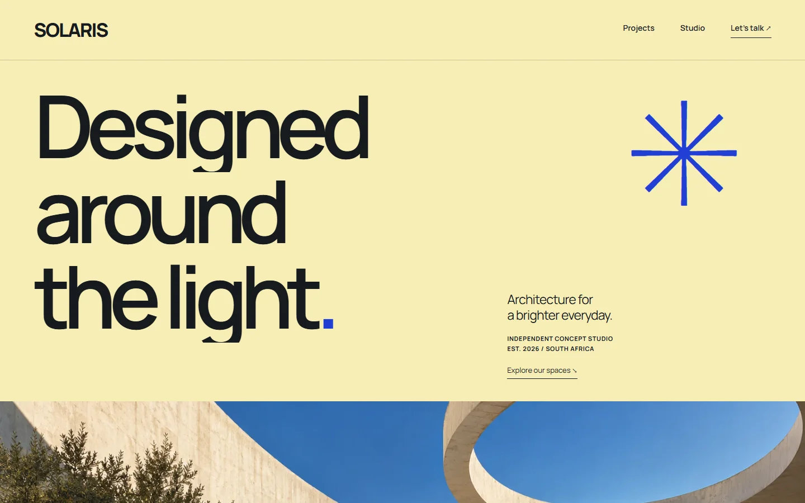
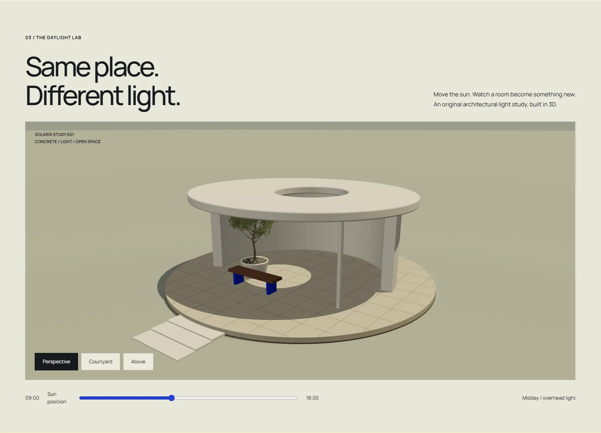

# SOLARIS — designed around the light

## Website and source

[Live website](https://20-solaris.williamking.workers.dev) · [Public source](https://github.com/WilliamHenryKing/20-solaris) · [Verification](docs/VERIFICATION.md) · [Release](docs/RELEASE.md)

Independent fictional architecture studio portfolio, commissioned 3 October 2026. Built with React, Vite, direct Three.js and GSAP. Optimistic butter yellow, ultramarine, monumental geometric typography and full-bleed original architectural imagery make a distinct sun-led visual world.

## Run and edit

`bun install --frozen-lockfile`, `bun run dev` (127.0.0.1:4530), `bun run check`, `bun run preview` (127.0.0.1:4630). Exact dependency pins and project-local assets.

Edit the project array and studio copy in `src/content.ts`. Routing and enquiry options live in `src/main.tsx`; styles in `src/style.css`; the original procedural pavilion in `src/Pavilion.tsx`. Hash routes provide home, project index/filter, individual studies, studio and contact. No backend required.

The Daylight Pavilion has a sun-position slider and three camera views. Its curved wall, floating oculus roof, supports, bench, planter and steps are original geometry. Shadows respond to light; it is an architectural illustration, not a calibrated solar-analysis tool. Rendering pauses offscreen/hidden, GPU resources dispose on unmount, DPR caps at 1.6, and unsupported WebGL retains explanatory content. Manual motion pause and live operating-system reduced motion are supported.

The contact view creates an editable local brief and downloads plain text. It collects no personal data and sends nothing. All projects are fictional, unbuilt studies; generated images imply no completed client commissions.

User authorized public GitHub and Cloudflare publication; root agent coordinates release and live verification. See HANDOFF.md for current verification boundaries and ASSETS.md for provenance.

## Interactive study

